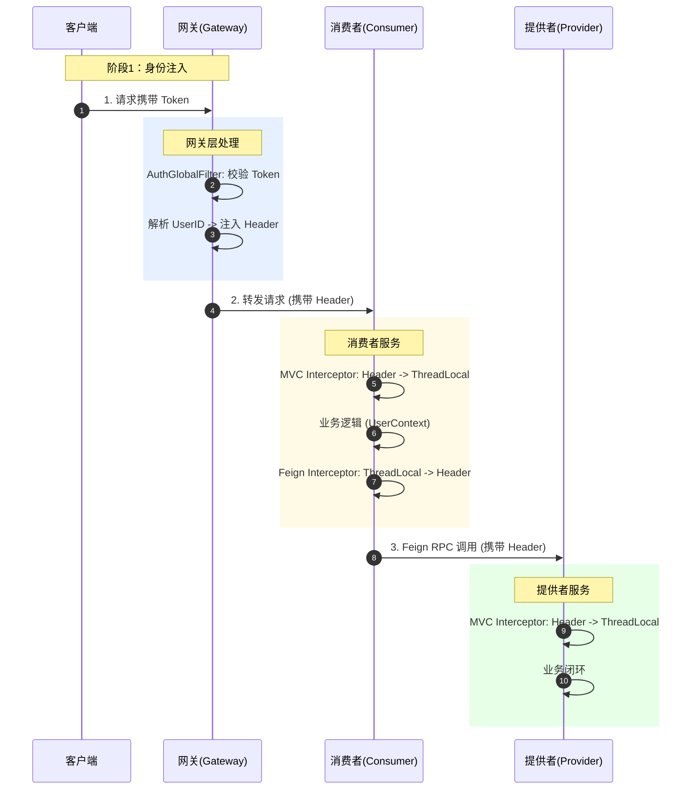
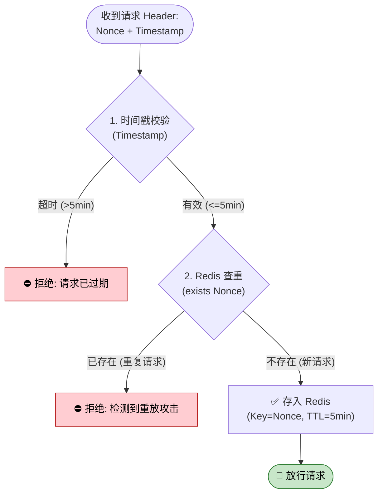
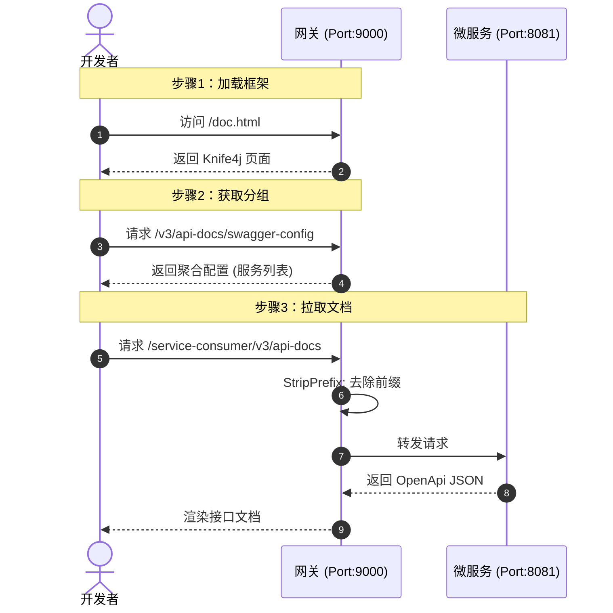

# 🛡️ Microservice Gateway Platform

> **微服务流量治理与统一接入平台**
>
> 基于 Spring Cloud Alibaba 生态构建的企业级微服务网关，深度整合了 **动态路由热更新**、**全链路身份安全闭环**、**Redis 防重放** 及 **可视化流量治理**。

---

## 🏗️ 系统架构图

---

## 🌟 核心特性与进度

### 🚀 Backend Core (后端核心)
*   ✅ **基础架构搭建**：完成 Nacos 注册中心接入，打通 Gateway -> Consumer -> Provider 调用链路。
*   ✅ **全链路身份闭环**：设计 `ThreadLocal` + `Feign` 拦截器透传方案，实现 Token/UserID 在微服务链中的无缝传递。
*   ✅ **动态路由热更新**：基于 Nacos Config 监听机制，实现路由配置修改**秒级生效**，无需重启网关。
*   ✅ **流量治理**：
    *   集成 Sentinel 实现网关层限流与熔断降级。
    *   **自定义异常处理**：返回标准化的 JSON 提示。
    *   配置规则持久化到 Nacos，避免重启丢失。
*   ✅ **安全防御体系**：
    *   **防重放攻击 (Replay Attack)**：基于 `Redis` + `Nonce` + `Timestamp` 机制，有效拦截恶意重复请求。
    *   **全局 CORS**：统一解决前后端分离跨域问题。
*   ✅ **API 文档聚合**：集成 Knife4j，统一聚合所有微服务的 Swagger 文档。

### 💻 可视化控制台
*   ✅ **管理后台**：基于 Vue 3 + Vite + Element Plus 构建。
*   ✅ **路由可视化管理**：彻底告别手写 JSON！实现路由的**在线新增、编辑、删除**，操作结果实时同步至 Nacos。
*   ⬜ **流量驾驶舱**：(TODO) 接入 ECharts 展示实时 QPS、CPU 水位监控。

---

## 🔍 核心技术原理解析

### 1. 全链路 Token 透传机制
> **技术原理**：采用“手提箱”模式。在网关层将 UserID 装入 HTTP Header，在服务内部存入 ThreadLocal，在发起 Feign 调用前再次拦截并注入 Header。

### 2. 防重放攻击防御机制 (Replay Attack Prevention)
> **技术原理**：利用 **Redis (Nonce) + Timestamp (时间戳)** 双重校验机制。防止黑客截获合法请求后进行恶意重放。

### 3. 统一接口文档聚合 (Knife4j Aggregation)
> **技术原理**：网关作为流量入口，统一拦截 Swagger 资源请求，并根据路由规则重写路径，将下游微服务的文档数据聚合展示。

### 4. 网关异步日志与审计

---

## 🛠️ 技术栈
*   **Core Framework**: Spring Boot 3.x, Spring Cloud Alibaba 2022.x
*   **Gateway**: Spring Cloud Gateway (WebFlux 响应式编程)
*   **Middleware**: Nacos 2.x, Sentinel, Redis
*   **RPC**: OpenFeign
*   **Frontend**: Vue 3, Vite, Element Plus, ECharts
