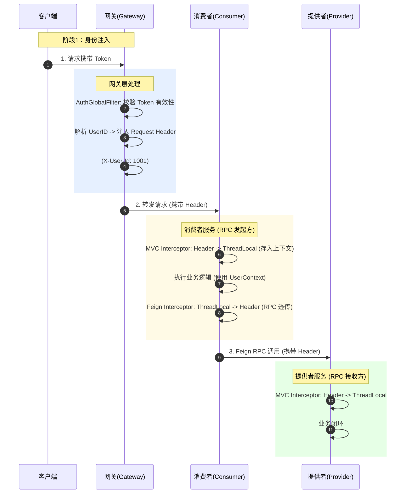
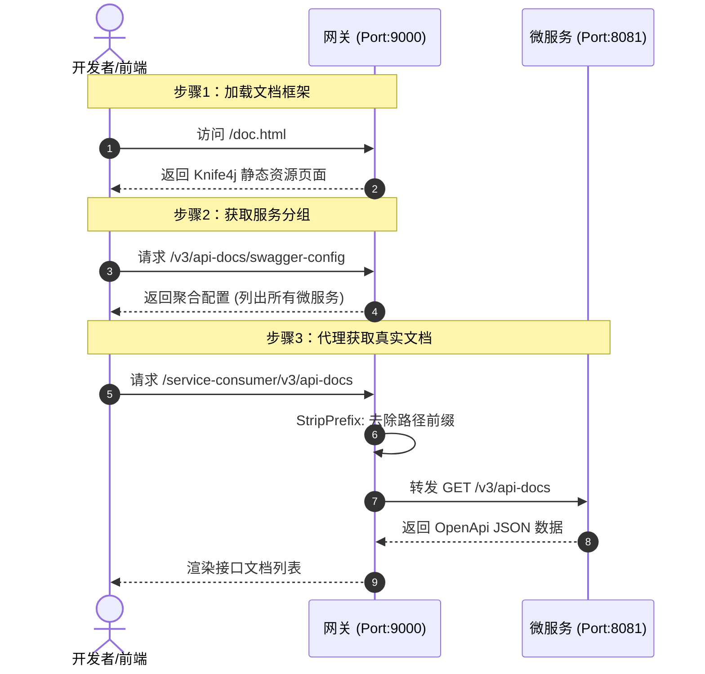

# 🛡️ Microservice Gateway Platform | 微服务流量治理与统一接入平台

> 基于 Spring Cloud Gateway + Nacos + Sentinel 的生产级微服务网关，实现了动态路由热更新、全链路身份安全闭环与可视化流量治理。

---

## 🏗️ System Architecture | 系统架构

```mermaid
graph TD
%% =======================
%% 🎨 样式定义 (强制深色字体)
%% =======================
%% 蓝色系：客户端 - 字体强制黑色
    classDef client fill:#e3f2fd,stroke:#1565c0,stroke-width:2px,rx:10,ry:10,color:#000;
%% 绿色系：网关 - 字体强制深绿
    classDef gateway fill:#e8f5e9,stroke:#2e7d32,stroke-width:2px,rx:5,ry:5,color:#1b5e20;
%% 黄色系：微服务 - 字体强制深棕
    classDef microservice fill:#fff9c4,stroke:#fbc02d,stroke-width:2px,rx:5,ry:5,color:#3e2723;
%% 紫色系：中间件 - 字体强制深紫
    classDef middleware fill:#f3e5f5,stroke:#7b1fa2,stroke-width:2px,rx:5,ry:5,color:#4a148c;
%% 青色系：数据库 - 字体强制深青
    classDef db fill:#e0f7fa,stroke:#006064,stroke-width:2px,rx:5,ry:5,color:#004d40;

%% =======================
%% 1. 顶层入口
%% =======================
    Client([💻 Client / Browser]):::client
Admin([🛠️ Vue3 Dashboard]):::client

%% =======================
%% 2. 网关层 (纵向责任链)
%% =======================
subgraph Gateway_Core [API Gateway Core]
direction TB
G_Auth[🛡️ Auth Filter]:::gateway
G_Sec[🔒 Security Filter]:::gateway
G_Limit[🚦 Sentinel Limiter]:::gateway
G_Route[🔀 Dynamic Routing]:::gateway

%% 内部流转
G_Auth --> G_Sec --> G_Limit --> G_Route
end

%% =======================
%% 3. 微服务层 (横向流水线)
%% =======================
subgraph Microservices [Microservice Call Chain]
direction LR
%% 节点
Consumer[🛒 Consumer Service]:::microservice
Feign_Int[⚡ Feign Interceptor]:::microservice
Provider[📦 Provider Service]:::microservice
MVC_Int[📥 MVC Interceptor]:::microservice

%% 流转逻辑
Consumer --1.RPC Call--> Feign_Int
Feign_Int --2.Header Relay--> MVC_Int
MVC_Int --3.Context Init--> Provider
end

%% =======================
%% 4. 基础设施层 (沉底)
%% =======================
subgraph Infrastructure [Infrastructure Base]
direction LR
Redis[("Redis (Cache/Lock)")]:::db
Sentinel[("Sentinel Dashboard")]:::middleware
Nacos[("Nacos (Config/Registry)")]:::middleware
end

%% =======================
%% 5. 跨层级连线
%% =======================

%% 入口连接
Client --> G_Auth
Admin --> G_Route

%% 网关向下分发
G_Route --> Consumer
G_Route --> Provider

%% 基础设施连接 (虚线)
G_Sec -.->|Check| Redis
G_Limit -.->|Push Rules| Sentinel
G_Route -.->|Pull Routes| Nacos

%% 服务注册与配置
Consumer -.->|Register| Nacos
Provider -.->|Register| Nacos

%% 布局辅助
Microservices ~~~ Infrastructure
```

---

## 🌟 Key Features | 核心特性与进度

### 🚀 Backend Core (后端核心)
*   ✅ **基础架构搭建**：完成 Nacos 注册中心接入，打通 Gateway -> Consumer -> Provider 调用链路。
*   ✅ **全链路身份闭环 (核心难点)**：
    *   设计 `ThreadLocal` + `Feign` 拦截器透传方案。
    *   解决了异步调用与 RPC 过程中 Token/UserID 丢失的问题，实现“零侵入”身份传递。
*   ✅ **动态路由热更新**：
    *   基于 Nacos Config 监听机制，实现路由配置修改**秒级生效**，无需重启网关。
*   ✅ **高可用流量治理**：
    *   集成 Sentinel 实现网关层限流与熔断降级。
    *   配置规则持久化到 Nacos，避免重启丢失。
*   ✅ **API 文档聚合**：集成 Knife4j，在网关层统一聚合所有下游微服务的 Swagger 文档。
*   ⬜ **高级安全**：(TODO) 待实现防重放攻击与 IP 黑名单过滤器。

### 💻 Frontend Visualization (可视化控制台)
*   ✅ **管理后台**：基于 Vue 3 + Element Plus 构建。
*   ✅ **路由可视化管理**：实现路由的**在线新增、编辑、删除**，操作结果实时同步至 Nacos。
*   ⬜ **流量驾驶舱**：(TODO) 接入 ECharts 展示实时 QPS、CPU 水位监控。

---

## 🔍 Core Logic Analysis | 核心技术原理解析

### 1. 全链路 Token 透传机制 (Identity Propagation)
> **解决痛点**：在微服务调用链中，用户信息通常只在网关层解析。下游服务之间互相调用（RPC）时，ThreadLocal 中的用户信息无法自动传递，导致鉴权失败。

**我的解决方案**：
采用“手提箱”模式。在网关层将 UserID 装入 HTTP Header（装箱），在服务内部存入 ThreadLocal（拆箱使用），在发起 Feign 调用前再次拦截并注入 Header（再次装箱）。

### 2. 统一接口文档聚合原理 (Knife4j Aggregation)
> **技术原理**：网关作为流量入口，统一拦截 Swagger 资源请求，并根据路由规则重写路径，将下游微服务的文档数据聚合展示。

---

### 🛠️ Tech Stack | 技术栈
*   **Core Framework**: Spring Boot 3.x, Spring Cloud Alibaba 2022.x
*   **Gateway**: Spring Cloud Gateway (WebFlux 响应式编程)
*   **Service Discovery & Config**: Nacos 2.x
*   **Flow Control**: Sentinel
*   **RPC**: OpenFeign
*   **Frontend**: Vue 3, Vite, Element Plus, ECharts

---
