# 🛡️ Microservice Gateway Platform

<p align="center">
  <strong>微服务流量治理与统一接入网关平台</strong>
</p>


<p align="center">
  
  
  
  
</p>

---

## 📖 项目简介

自主研发的微服务网关平台，深度整合了**全链路鉴权**、**动态路由**、**流量治理**、**安全防御**、**异步日志**及**可视化配置与监控**，构建了安全可观测的流量入口。

### ✨ 核心亮点

- 🔐 **安全防护**：JWT 鉴权 + Redis 防重放攻击双重保障
- 🚦 **流量治理**：Sentinel 限流熔断 + Nacos 动态路由热更新
- 📊 **实时可观测性**：QPS/延迟/拓扑实时监控 + 异步日志审计
- 🎨 **可视化控制台**：Vue3 + Element Plus 打造的现代化流量驾驶舱
- ⚡ **性能架构**：响应式编程模型，单机 QPS 突破 1300+

---

## 🏗️ 系统架构

网关基于 Spring Cloud Gateway 响应式框架构建，作为核心入口统一调度下游微服务。

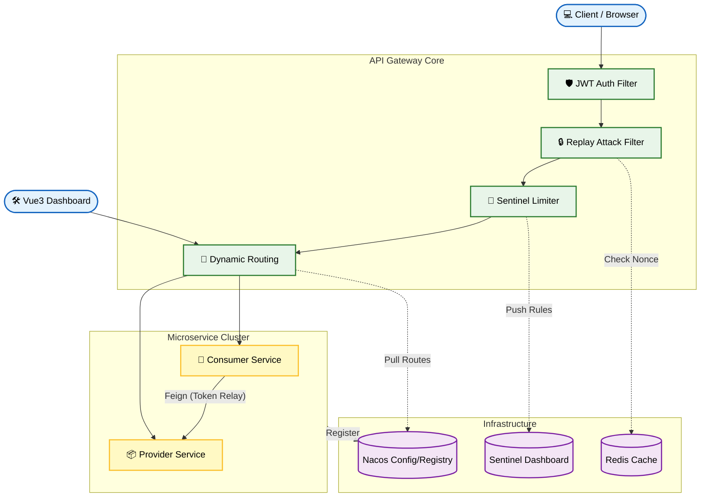
```mermaid
graph TD
%% =======================
%% 🎨 样式定义 (高对比度配色)
%% =======================
%% 蓝色系：客户端 - 黑字
    classDef client fill:#e3f2fd,stroke:#1565c0,stroke-width:2px,color:#000000;
%% 绿色系：网关 - 黑字
    classDef gateway fill:#e8f5e9,stroke:#2e7d32,stroke-width:2px,color:#000000;
%% 黄色系：微服务 - 黑字
    classDef service fill:#fff9c4,stroke:#fbc02d,stroke-width:2px,color:#000000;
%% 紫色系：基础设施 - 黑字
    classDef infra fill:#f3e5f5,stroke:#7b1fa2,stroke-width:2px,color:#000000;

%% =======================
%% 1. 入口层
%% =======================
    Client([💻 Client / Browser]):::client
    Admin([🛠️ Vue3 Dashboard]):::client

%% =======================
%% 2. 网关核心层 (Gateway)
%% =======================
subgraph Gateway_Core ["API Gateway Core"]
    direction TB
    G_Auth["🛡️ JWT Auth Filter"]:::gateway
    G_Sec["🔒 Replay Attack Filter"]:::gateway
    G_Limit["🚦 Sentinel Limiter"]:::gateway
    G_Route["🔀 Dynamic Routing"]:::gateway
    
    %% 流程：鉴权 -> 防重放 -> 限流 -> 路由
    G_Auth --> G_Sec --> G_Limit --> G_Route
end

%% =======================
%% 3. 微服务层 (Service Mesh)
%% =======================
subgraph Services ["Microservice Cluster"]
    direction LR
    Consumer["🛒 Consumer Service"]:::service
    Provider["📦 Provider Service"]:::service
    
    %% 内部RPC
    Consumer --"Feign (Token Relay)"--> Provider
end

%% =======================
%% 4. 基础设施层 (Infra)
%% =======================
subgraph Infrastructure ["Infrastructure"]
    Nacos[("Nacos Config/Registry")]:::infra
    Sentinel[("Sentinel Dashboard")]:::infra
    Redis[("Redis Cache")]:::infra
end

%% =======================
%% 5. 连线关系
%% =======================
    Client --> G_Auth
    Admin --> G_Route

    %% 网关向下分发
    G_Route --> Consumer
    G_Route --> Provider

    %% 基础设施交互
    G_Sec -.->|Check Nonce| Redis
    G_Limit -.->|Push Rules| Sentinel
    G_Route -.->|Pull Routes| Nacos
    Services -.->|Register| Nacos
```

---

## 🌟 核心特性

### 🚦 流量治理与动态配置

- **动态路由热更新**：基于 Nacos Config 监听机制，实现路由配置修改实时生效，避免了传统配置修改需重启网关的问题
- **精细化限流熔断**：集成 Sentinel 实现了针对不同服务路径的限流保护，并自定义了标准化的 JSON 异常回执

### 🛡️ 安全防御体系

- **防重放攻击**：利用 Redis 存储 Nonce + 时间戳校验，通过双重验证拦截恶意重复请求，增强了接口安全性
- **全链路身份透传**：设计了"网关解析-拦截器注入-Feign透传"的闭环方案，确保 UserID 等信息在微服务调用链中无感知传递
- **全局跨域支持**：统一处理 WebFlux 响应式环境下的 CORS 跨域问题

### 📝 观测与审计

- **异步日志系统**：基于网关全局过滤器采集流量日志，通过消息队列解耦，由后台服务异步存库，确保不影响主链路性能
- **API 文档聚合**：集成 Knife4j 自动发现下游微服务 Doc 资源，实现在网关入口统一查阅全量接口文档

---

## 💻 流量驾驶舱与可视化配置

这是本系统的核心管理终端，实现了从"手写配置"到"图形化操作"的转变，提升了运维与开发效率。

### 📊 实时监控大屏

直观展示网络拓扑、QPS、错误率及响应耗时等指标。

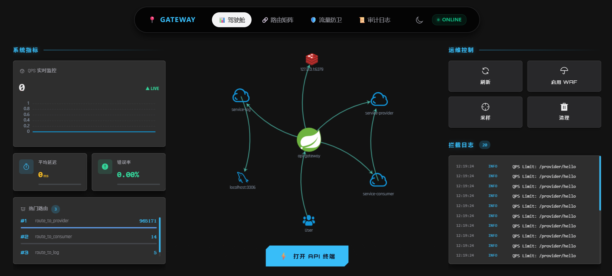

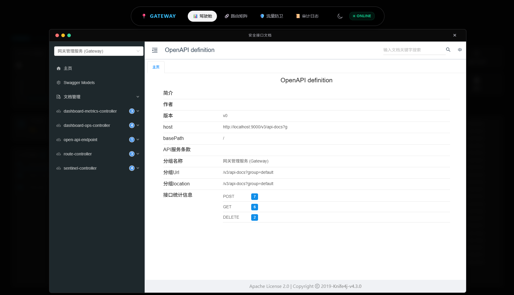

### 🎯 可视化配置管理

**原生 Nacos 控制台配置繁琐：**

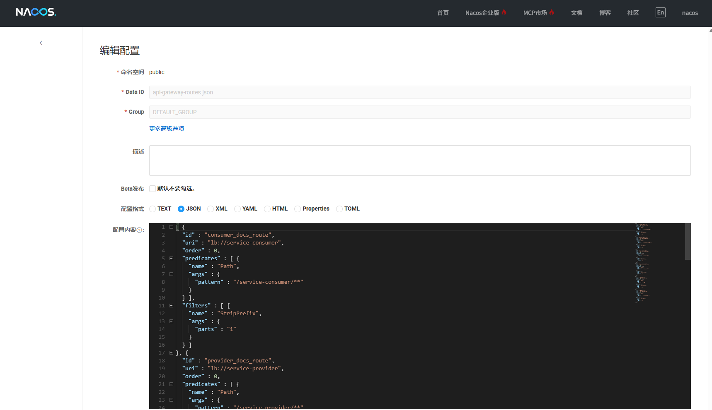

**自研控制台配置便捷高效：**

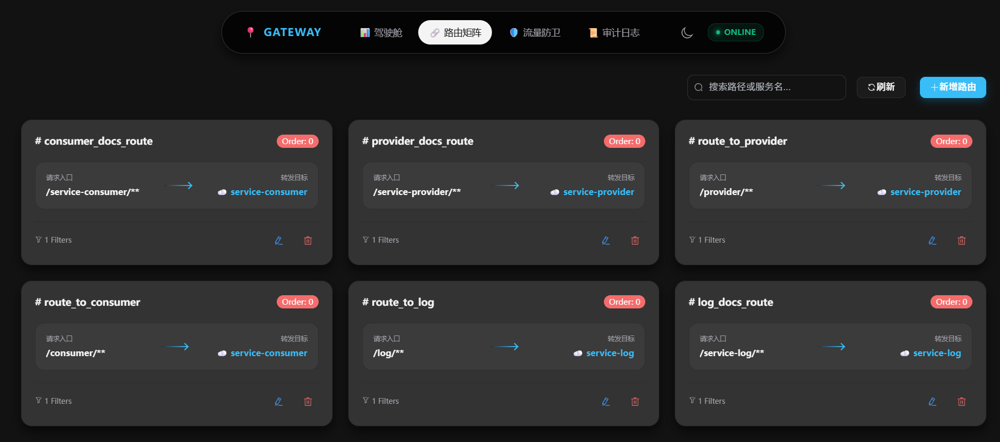

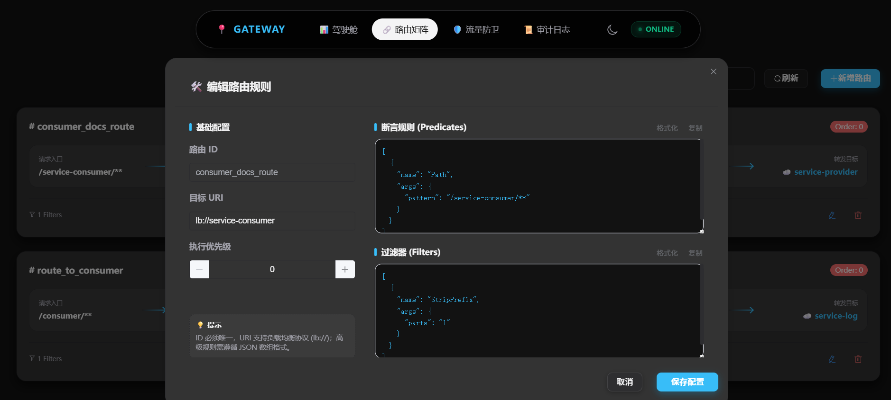

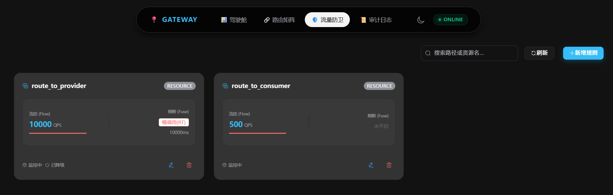


---

## ⚡ 性能压测报告

### 🖥️ 测试环境

> **注**：本次压测在 Windows 开发机上进行，采用 **单机全栈混部** 模式。网关、微服务、Redis、SkyWalking、JMeter 均运行在同一物理机上，存在严重的 CPU 时间片争抢与端口资源竞争。

| 组件         | 配置/版本                | 备注                                                         |
| :----------- | :----------------------- | :----------------------------------------------------------- |
| **CPU**      | Intel i7-1165G7 (4核)   | 笔记本处理器                                                 |
| **内存**     | 24GB DDR4/5              | 网关 JVM 分配 4GB                                            |
| **网关**     | Spring Cloud Gateway 3.x | **开启** Sentinel 限流 + SkyWalking 探针 + Redis 全量埋点 + JWT 鉴权 |
| **下游服务** | Service-Provider         | 简单 Echo 接口，模拟微服务调用                               |
| **中间件**   | Redis 5.x + Nacos 2.x    | 单节点部署                                                   |
| **压测工具** | JMeter 5.x               | Windows 图形界面版，30 并发，无限循环，KeepAlive 开启        |

---

### 📊 性能对比与分析

在单机网络 I/O 翻倍（Gateway转发特性）及全链路治理组件开启的高负载下，经过非阻塞架构改造，网关吞吐量实现了质的飞跃。

| 阶段       | 峰值 QPS  | 稳定性                                                       | 瓶颈分析                                                     |
| :--------- | :-------- | :----------------------------------------------------------- | :----------------------------------------------------------- |
| **优化前** | 200 ~ 500 | ❌ **极不稳定**<br>运行 3 分钟后 QPS 断崖式下跌至 100 以内，伴随高延迟 | **同步阻塞 I/O**：使用 `StringRedisTemplate` 阻塞 Netty 线程；<br>**资源积压**：SkyWalking 采样率过高导致 OOM；<br>**线程切换**：频繁自定义线程池切换导致 Context 丢失 |
| **优化后** | **1300+** | ✅ **稳如泰山**<br>长时压测曲线平滑，无 Full GC，无延迟毛刺 | **全链路异步**：切换 `ReactiveRedisTemplate` + Pipeline；<br>**零拷贝**：移除多余对象创建；<br>**反压保护**：优化 SkyWalking 采样率与 Netty 线程模型 |

**📷 优化前截图 (阻塞/OOM)：**

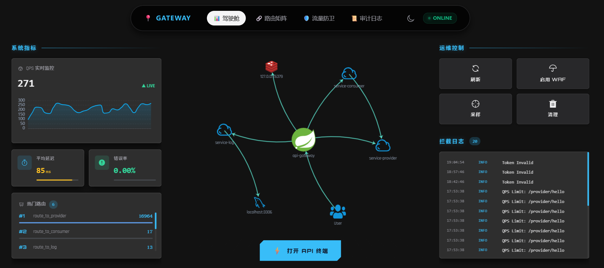

**📷 优化后截图 (稳定 1300+)：**


### 📉 性能损耗漏斗分析

针对下游 Provider 直测 QPS 可达 **6500+**，而网关转发 QPS 为 **1300+** 的现象，经分析属于合理的**架构损耗**，具体拆解如下：

#### 1️⃣ 网络 I/O 翻倍 (50% 损耗)

- **直连**：`Client -> Provider` (1次交互)
- **网关**：`Client -> Gateway -> Provider -> Gateway -> Client` (2次完整交互，序列化/反序列化开销翻倍)
- *理论上限：3250 QPS*

#### 2️⃣ 治理组件税收 (30% 损耗)

- **SkyWalking**：字节码增强、Trace Context 生成与跨进程传播
- **Sentinel**：实时滑动窗口统计、规则校验
- *理论上限：2275 QPS*

#### 3️⃣ 业务逻辑开销 (10% 损耗)

- **Redis**：每个请求触发 5+ 次异步埋点（QPS/Latency/TopN）
- **JWT**：SHA256 验签计算
- *理论上限：1820 QPS*

#### 4️⃣ 单机资源争抢 (20%~30% 损耗)

- JMeter 压测端与网关服务端抢占同一 CPU 资源，导致严重的 Context Switch
- *实测结果：1300+ QPS*

> **💡 结论**：在 Windows 单机混部且开启全套治理逻辑的前提下，**1300 QPS 代表了该硬件环境下非阻塞 IO 的性能极限**。若部署至 Linux 独立服务器，预计 QPS 可提升至 **10k+**。

---

## 🔍 关键技术原理

### 5.1 全链路 Token 透传流程

采用 `ThreadLocal` 结合 `Feign RequestInterceptor`。网关层负责身份校验与 Header 注入，业务层负责上下文获取。

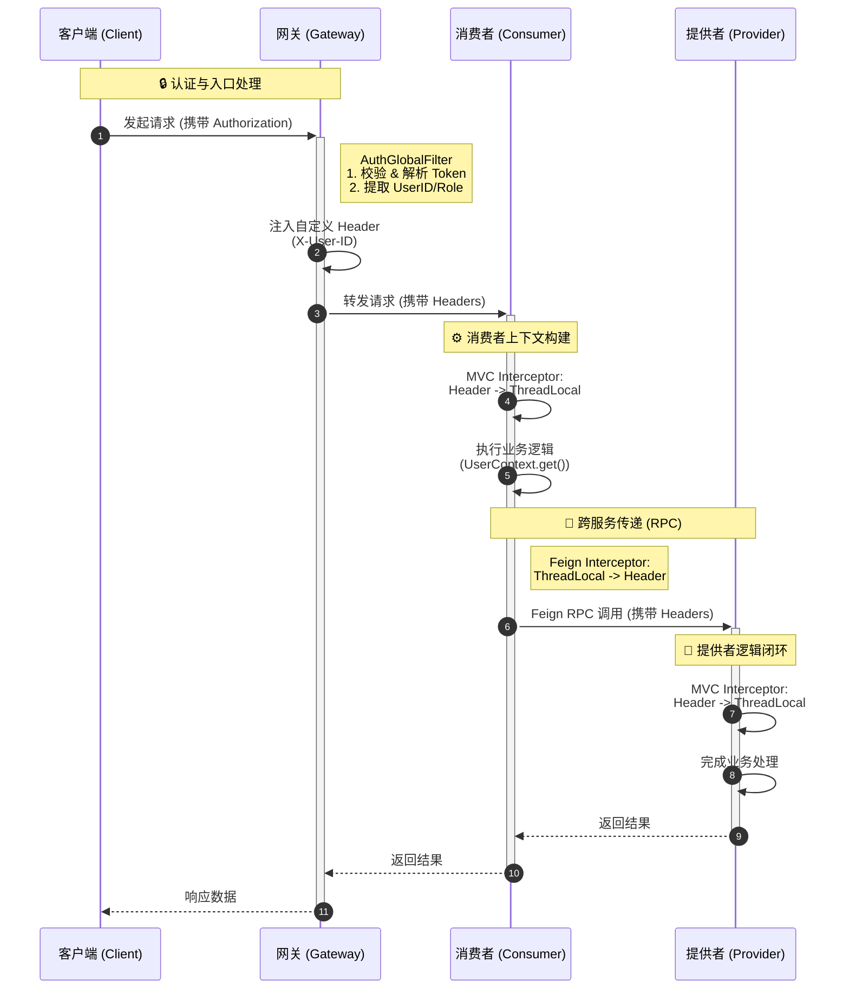
```mermaid
sequenceDiagram
    autonumber
    
    %% 定义参与者颜色和别名
    participant C as 客户端 (Client)
    participant G as 网关 (Gateway)
    participant S1 as 消费者 (Consumer)
    participant S2 as 提供者 (Provider)

    Note over C, G: 🔒 认证与入口处理
    C->>+G: 发起请求 (携带 Authorization)
    
    Note right of G: AuthGlobalFilter<br/>1. 校验 & 解析 Token<br/>2. 提取 UserID/Role
    G->>G: 注入自定义 Header<br/>(X-User-ID)
    
    G->>+S1: 转发请求 (携带 Headers)

    Note over S1: ⚙️ 消费者上下文构建
    S1->>S1: MVC Interceptor:<br/>Header -> ThreadLocal
    S1->>S1: 执行业务逻辑<br/>(UserContext.get())

    Note over S1, S2: 🔗 跨服务传递 (RPC)
    Note right of S1: Feign Interceptor:<br/>ThreadLocal -> Header
    S1->>+S2: Feign RPC 调用 (携带 Headers)

    Note over S2: 🎯 提供者逻辑闭环
    S2->>S2: MVC Interceptor:<br/>Header -> ThreadLocal
    S2->>S2: 完成业务处理

    S2-->>-S1: 返回结果
    S1-->>-G: 返回结果
    G-->>-C: 响应数据
```

### 5.2 防重放校验机制

1. **时间戳校验**：拦截超过 5 分钟的过期请求
2. **Redis 查重**：验证 Nonce（唯一标识）是否存在，防止在有效期内的请求被二次利用

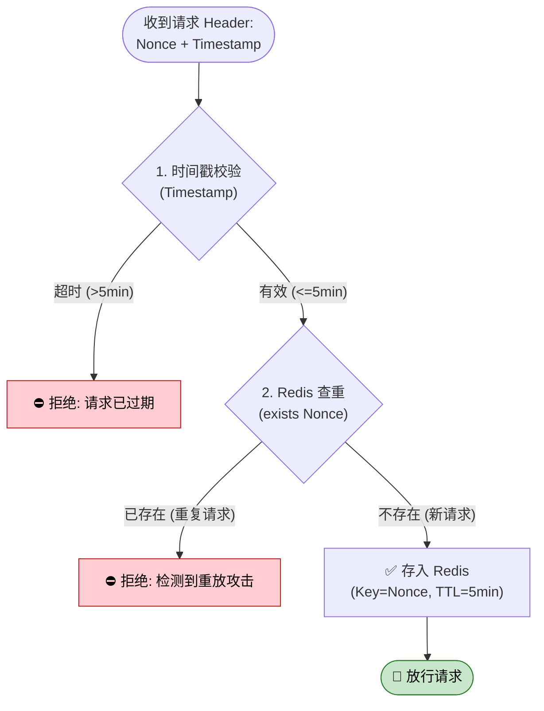
```mermaid
flowchart TD
    Start(["收到请求 Header: <br/>Nonce + Timestamp"]) --> CheckTime{"1. 时间戳校验<br/>(Timestamp)"}
    
    CheckTime -- "超时 (>5min)" --> Reject1["⛔ 拒绝: 请求已过期"]
    CheckTime -- "有效 (<=5min)" --> CheckRedis{"2. Redis 查重<br/>(exists Nonce)"}
    
    CheckRedis -- "已存在 (重复请求)" --> Reject2["⛔ 拒绝: 检测到重放攻击"]
    CheckRedis -- "不存在 (新请求)" --> SaveRedis["✅ 存入 Redis<br/>(Key=Nonce, TTL=5min)"]
    
    SaveRedis --> Pass(["🚀 放行请求"])
    
    style Reject1 fill:#ffcdd2,stroke:#b71c1c,color:#000
    style Reject2 fill:#ffcdd2,stroke:#b71c1c,color:#000
    style Pass fill:#c8e6c9,stroke:#2e7d32,color:#000
```

### 5.3 接口文档聚合

网关作为流量入口，统一拦截 Swagger 资源请求，并根据路由规则重写路径，将下游微服务的文档数据聚合展示。

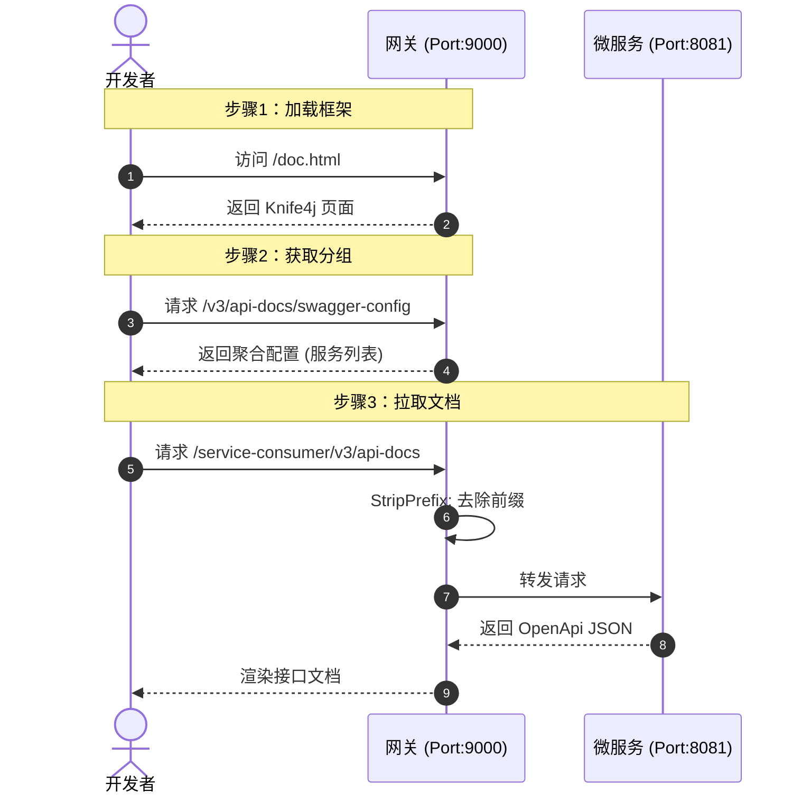
```mermaid
sequenceDiagram
    autonumber
    actor User as 开发者
    participant Gateway as 网关 (Port:9000)
    participant Consumer as 微服务 (Port:8081)

    Note over User, Gateway: 步骤1：加载框架
    User->>Gateway: 访问 /doc.html
    Gateway-->>User: 返回 Knife4j 页面

    Note over User, Gateway: 步骤2：获取分组
    User->>Gateway: 请求 /v3/api-docs/swagger-config
    Gateway-->>User: 返回聚合配置 (服务列表)

    Note over User, Consumer: 步骤3：拉取文档
    User->>Gateway: 请求 /service-consumer/v3/api-docs
    Gateway->>Gateway: StripPrefix: 去除前缀
    Gateway->>Consumer: 转发请求
    Consumer-->>Gateway: 返回 OpenApi JSON
    Gateway-->>User: 渲染接口文档
```

### 5.4 异步日志架构

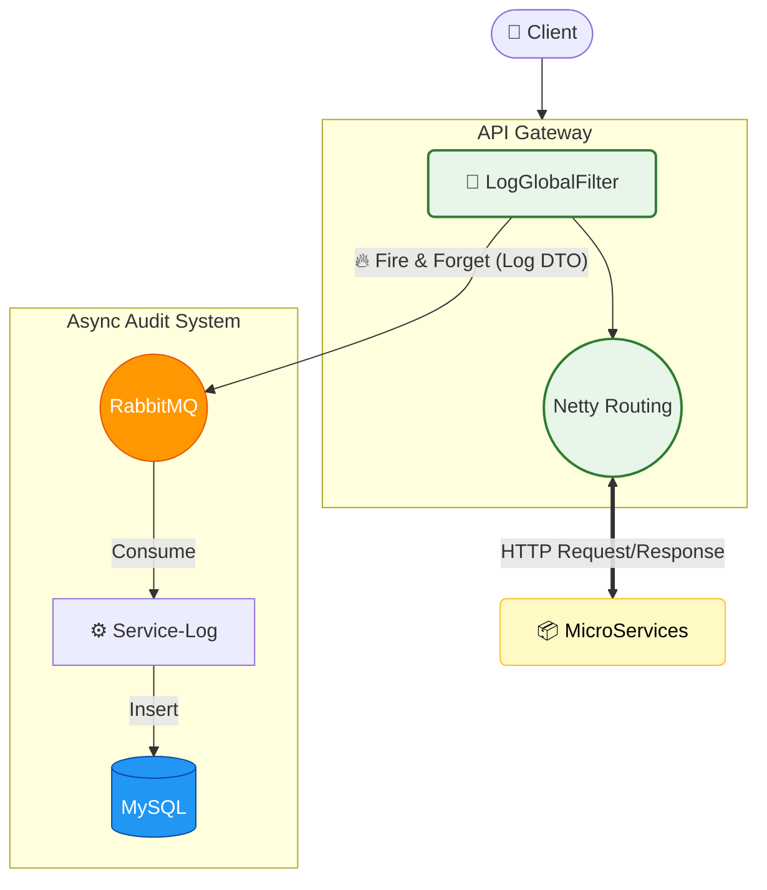
```mermaid
graph TD
%% 样式定义
    classDef client fill:#e3f2fd,stroke:#1565c0,stroke-width:2px;
    classDef filter fill:#e8f5e9,stroke:#2e7d32,stroke-width:2px,rx:5;
    classDef mq fill:#ff9800,stroke:#e65100,color:white,rx:5;
    classDef db fill:#2196f3,stroke:#0d47a1,color:white,rx:5;
    classDef service fill:#fff9c4,stroke:#fbc02d,color:black,rx:5;

    Client([👤 Client]) --> Gateway

subgraph Gateway [API Gateway]
%% 核心逻辑：Filter 只是一个切面
LogFilter[📝 LogGlobalFilter]:::filter
Routing((Netty Routing)):::filter

LogFilter --> Routing
end

%% 主业务流 (Main Flow)
Routing <==>|HTTP Request/Response| MicroService[📦 MicroServices]:::service

%% 异步旁路 (Async Sidecar)
LogFilter --"🔥 Fire & Forget (Log DTO)"--> MQ

subgraph Async_Audit [Async Audit System]
MQ((RabbitMQ)):::mq
LogService[⚙️ Service-Log]
DB[(MySQL)]:::db

MQ -->|Consume| LogService
LogService -->|Insert| DB
end
```

---

## 🛠️ 技术栈

### 后端技术

| 分类 | 技术选型 |
|------|----------|
| **核心框架** | Spring Boot 3.2.5 + Spring Cloud 2023.0.1 |
| **微服务生态** | Spring Cloud Alibaba |
| **网关引擎** | Spring Cloud Gateway (响应式) |
| **远程调用** | OpenFeign |
| **注册中心** | Nacos 2.x |
| **配置中心** | Nacos Config |
| **限流熔断** | Sentinel |
| **缓存** | Redis 5.x |
| **消息队列** | RabbitMQ |
| **链路追踪** | SkyWalking |
| **文档聚合** | Knife4j |

### 前端技术

| 分类 | 技术选型 |
|------|----------|
| **核心框架** | Vue 3 + Vite |
| **UI 组件库** | Element Plus |
| **图表库** | ECharts |
| **HTTP 客户端** | Axios |
| **路由管理** | Vue Router |

---

## 📂 项目结构

```
spring-cloud-demo/
├── api-gateway/              # API 网关核心模块
│   ├── src/main/java/
│   │   └── com/rcpawn/
│   │       ├── filter/       # 全局过滤器 (鉴权/防重放/限流/日志)
│   │       ├── config/       # 网关配置类
│   │       └── route/        # 动态路由管理
│   └── src/main/resources/
├── gateway-dashboard/        # Vue3 可视化控制台
│   ├── src/
│   │   ├── views/            # 页面组件 (监控/路由/日志/Sentinel)
│   │   ├── api/              # API 接口封装
│   │   └── components/       # 公共组件 (拓扑图等)
│   └── package.json
├── service-common/           # 公共服务模块
├── service-consumer/         # 服务消费者示例
├── service-provider/         # 服务提供者示例
├── service-log/              # 异步日志服务
└── pom.xml                   # Maven 父工程
```

---

## 🚀 快速开始

### 前置要求

- JDK 17+
- Maven 3.8+
- Node.js 16+
- MySQL 8.0+
- Redis 5.x+
- RabbitMQ 3.x+
- Nacos 2.x+
- Sentinel Dashboard

### 环境准备

1. **启动中间件**

```bash
# 按顺序启动以下服务
- Nacos (默认端口: 8848)
- Sentinel Dashboard (默认端口: 8080)
- Redis (默认端口: 6379)
- RabbitMQ (默认端口: 5672, 管理界面: 15672)
- MySQL (默认端口: 3306)
```

2. **初始化数据库**

执行 `service-log/src/main/resources/schema.sql` 创建日志表

3. **配置 Nacos**

在 Nacos 控制台创建配置：
- **Data ID**: `gateway-rules.yaml`
- **Group**: `DEFAULT_GROUP`
- **配置内容**: 参考 `api-gateway/src/main/resources/application.yml`

### 启动服务

#### 后端服务

```bash
# 编译整个项目
mvn clean install

# 依次启动微服务
cd service-provider && mvn spring-boot:run
cd service-consumer && mvn spring-boot:run
cd service-log && mvn spring-boot:run
cd api-gateway && mvn spring-boot:run
```

#### 前端控制台

```bash
cd gateway-dashboard
npm install
npm run dev
```

### 访问地址

| 服务 | 地址 | 说明 |
|------|------|------|
| **网关入口** | http://localhost:9000 | API 统一入口 |
| **可视化控制台** | http://localhost:5173 | 流量驾驶舱 |
| **Nacos 控制台** | http://localhost:8848/nacos | 注册/配置中心 |
| **Sentinel 控制台** | http://localhost:8080 | 限流熔断监控 |
| **Knife4j 文档** | http://localhost:9000/doc.html | API 文档聚合 |
| **RabbitMQ 管理** | http://localhost:15672 | 消息队列监控 |

---

## 📸 功能演示

### 实时监控


### 路由管理


### 限流熔断


---

## 📝 开发笔记

更多技术细节请参考 [开发笔记](./开发笔记/) 目录：

- [动态路由架构](./开发笔记/初期/1.动态路由架构.md)
- [可观测架构](./开发笔记/初期/2.可观测架构.md)
- [安全架构升级](./开发笔记/初期/3.安全架构升级.md)
- [防重放攻击解析](./开发笔记/初期/防重放攻击解析.md)
- [异步日志设计](./开发笔记/初期/异步日志设计.md)
- [流量驾驶舱设计](./开发笔记/流量驾驶舱设计.md)
- [网关并发压测 OOM 与高延迟优化](./开发笔记/网关并发压测%20OOM%20与高延迟优化.md)

---

## 🤝 贡献指南

欢迎提交 Issue 和 Pull Request！

1. Fork 本仓库
2. 创建特性分支 (`git checkout -b feature/AmazingFeature`)
3. 提交更改 (`git commit -m 'Add some AmazingFeature'`)
4. 推送到分支 (`git push origin feature/AmazingFeature`)
5. 开启 Pull Request

---

## 📧 联系方式

如有问题或建议，欢迎通过以下方式联系：

- 📮 Email: your-email@example.com
- 💬 Issues: [GitHub Issues](https://github.com/your-username/microservice-gateway/issues)

---

<p align="center">
  <strong>⭐ 如果这个项目对你有帮助，请给个 Star 支持一下！⭐</strong>
</p>
