```mermaid
sequenceDiagram
    autonumber
    actor User as 开发者
    participant Gateway as 网关 (Port:9000)
    participant Consumer as 微服务 (Port:8081)

    Note over User, Gateway: 步骤1：加载框架
    User->>Gateway: 访问 /doc.html
    Gateway-->>User: 返回 Knife4j 页面

    Note over User, Gateway: 步骤2：获取分组
    User->>Gateway: 请求 /v3/api-docs/swagger-config
    Gateway-->>User: 返回聚合配置 (服务列表)

    Note over User, Consumer: 步骤3：拉取文档
    User->>Gateway: 请求 /service-consumer/v3/api-docs
    Gateway->>Gateway: StripPrefix: 去除前缀
    Gateway->>Consumer: 转发请求
    Consumer-->>Gateway: 返回 OpenApi JSON
    Gateway-->>User: 渲染接口文档
```

# 🛡️ Microservice Gateway Platform

> **微服务流量治理与统一接入平台**
>
> 自主研发的微服务网关平台，深度整合了**全链路鉴权**、**动态路由**、**流量治理**、**安全防御**、**异步日志**及**可视化配置与监控**，构建了安全可观测的流量入口。

------

## 🏗️ 1. 系统架构

网关基于 Spring Cloud Gateway 响应式框架构建，作为核心入口统一调度下游微服务。

------

## 💻 2. 流量驾驶舱与可视化配置

这是本系统的核心管理终端，实现了从“手写配置”到“图形化操作”的转变，提升了运维与开发效率。

- **实时流量监控**：直观展示网络拓扑、QPS、错误率及响应耗时等指标。
- **路由、流控、熔断在线治理**：可视化配置动态路由，限流、降级规则。

**测试数据说明**：

| 项目             | 详情                                                         |
| ---------------- | ------------------------------------------------------------ |
| **压测工具**     | Apache JMeter（Windows 图形界面版）                          |
| **压测并发**     | 30 个并发线程                                                |
| **网关部署**     | 运行于 Windows 宿主机的 Java 进程                            |
| **同时运行进程** | IntelliJ IDEA、Chrome 浏览器（多标签页）、网关依赖的中间件及数据库等环境进程 |
| **网络环境**     | 本机回环网络（127.0.0.1）                                    |

>  优化前（代码有阻塞逻辑，性能略低）：

> 优化后（待更新，网关性能应该是还可以，之前电脑状态好，测试能够几乎水平线稳定1000+）
>
> 注：限制 SkyWalking 采样率后性能有所提升，但这会导致出现 User -> service 的拓扑连线

------

## 🌟 3. 核心特性

### 🚦 流量治理与动态配置

- **动态路由热更新**：基于 Nacos Config 监听机制，实现路由配置修改实时生效，避免了传统配置修改需重启网关的问题。
- **精细化限流熔断**：集成 Sentinel 实现了针对不同服务路径的限流保护，并自定义了标准化的 JSON 异常回执。

### 🛡️ 安全防御体系

- **防重放攻击**：利用 Redis 存储 Nonce + 时间戳校验，通过双重验证拦截恶意重复请求，增强了接口安全性。
- **全链路身份透传**：设计了“网关解析-拦截器注入-Feign透传”的闭环方案，确保 UserID 等信息在微服务调用链中无感知传递。
- **全局跨域支持**：统一处理 WebFlux 响应式环境下的 CORS 跨域问题。

### 📝 观测与审计

- **异步日志系统**：基于网关全局过滤器采集流量日志，通过消息队列解耦，由后台服务异步存库，确保不影响主链路性能。
- **API 文档聚合**：集成 Knife4j 自动发现下游微服务 Doc 资源，实现在网关入口统一查阅全量接口文档。

------

## 🔍 4. 关键技术原理

### 4.1 全链路 Token 透传流程

采用 `ThreadLocal` 结合 `Feign RequestInterceptor`。网关层负责身份校验与 Header 注入，业务层负责上下文获取。

```mermaid
sequenceDiagram
    autonumber
    
    %% 定义参与者颜色和别名
    participant C as 客户端 (Client)
    participant G as 网关 (Gateway)
    participant S1 as 消费者 (Consumer)
    participant S2 as 提供者 (Provider)

    Note over C, G: 🔒 认证与入口处理
    C->>+G: 发起请求 (携带 Authorization)
    
    Note right of G: AuthGlobalFilter<br/>1. 校验 & 解析 Token<br/>2. 提取 UserID/Role
    G->>G: 注入自定义 Header<br/>(X-User-ID)
    
    G->>+S1: 转发请求 (携带 Headers)

    Note over S1: ⚙️ 消费者上下文构建
    S1->>S1: MVC Interceptor:<br/>Header -> ThreadLocal
    S1->>S1: 执行业务逻辑<br/>(UserContext.get())

    Note over S1, S2: 🔗 跨服务传递 (RPC)
    Note right of S1: Feign Interceptor:<br/>ThreadLocal -> Header
    S1->>+S2: Feign RPC 调用 (携带 Headers)

    Note over S2: 🎯 提供者逻辑闭环
    S2->>S2: MVC Interceptor:<br/>Header -> ThreadLocal
    S2->>S2: 完成业务处理

    S2-->>-S1: 返回结果
    S1-->>-G: 返回结果
    G-->>-C: 响应数据
```

### 4.2 防重放校验机制

1. **时间戳校验**：拦截超过 5 分钟的过期请求。
2. **Redis 查重**：验证 Nonce（唯一标识）是否存在，防止在有效期内的请求被二次利用。

```mermaid
flowchart TD
    %% 修复语法：给所有文本加上双引号，确保特殊字符不报错
    Start(["收到请求 Header: <br/>Nonce + Timestamp"]) --> CheckTime{"1. 时间戳校验<br/>(Timestamp)"}
    
    CheckTime -- "超时 (>5min)" --> Reject1["⛔ 拒绝: 请求已过期"]
    CheckTime -- "有效 (<=5min)" --> CheckRedis{"2. Redis 查重<br/>(exists Nonce)"}
    
    CheckRedis -- "已存在 (重复请求)" --> Reject2["⛔ 拒绝: 检测到重放攻击"]
    CheckRedis -- "不存在 (新请求)" --> SaveRedis["✅ 存入 Redis<br/>(Key=Nonce, TTL=5min)"]
    
    SaveRedis --> Pass(["🚀 放行请求"])
    
    style Reject1 fill:#ffcdd2,stroke:#b71c1c,color:#000
    style Reject2 fill:#ffcdd2,stroke:#b71c1c,color:#000
    style Pass fill:#c8e6c9,stroke:#2e7d32,color:#000
```

### 4.3 接口文档聚合

网关作为流量入口，统一拦截 Swagger 资源请求，并根据路由规则重写路径，将下游微服务的文档数据聚合展示。

### 4.4 异步日志

---

## 🛠️ 5. 核心技术栈

- **核心框架**：Spring Boot 3.x, Spring Cloud Gateway
- **中间件**：Nacos 2.x (注册/配置), Sentinel, Redis, RabbitMQ
- **远程调用**：OpenFeign
- **前端生态**：Vue 3, Vite, Element Plus, ECharts

------

## 📖 6. 运行指引

1. **环境启动**：启动 Nacos、Sentinel、SkyWalking、Redis、MySQL 及 RabbitMQ。
2. **网关配置**：在 Nacos 中创建 `gateway-rules` 配置分组，用于存储动态路由 JSON。
3. **服务接入**：微服务引入相关 Starter 并注册至 Nacos。
4. **控制台访问**：启动 Vue 项目，通过 `localhost:5173` 进行网关监控与配置。
