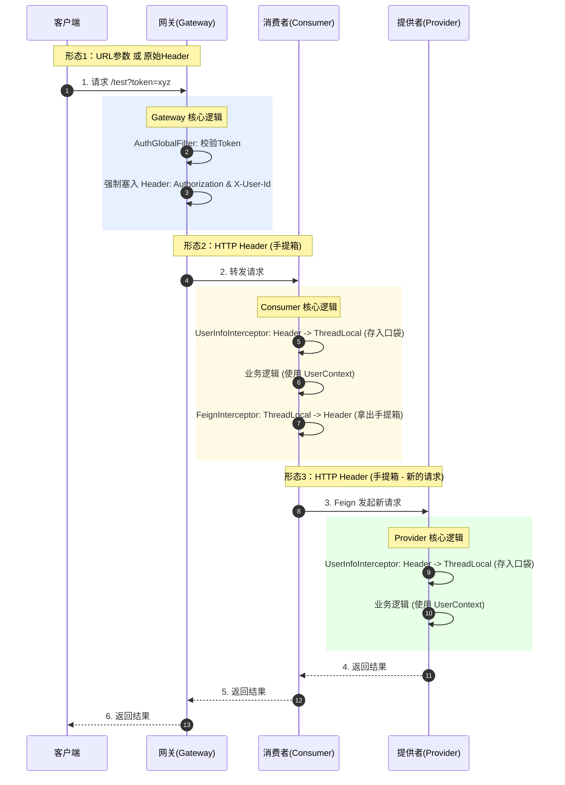

### 🎬 形象比喻：特工与机密文件

想象一下，你的系统是一个层级森严的**军事基地**。
*   **User (用户)**：外来访客。
*   **Token (令牌)**：**通行证**（比如一张磁卡）。
*   **UserID**：**身份工牌**（写着“特工007”）。
*   **Gateway (网关)**：**基地大门安检处**。
*   **Consumer (消费者服务)**：**1号情报大楼**。
*   **Provider (提供者服务)**：**2号档案大楼**。
*   **ThreadLocal**：每个特工自己的**上衣口袋**。
*   **Feign**：连接两栋大楼的**摆渡车**。

#### 剧情开始：

1.  **大门安检 (Gateway)**：
    *   访客带着**通行证(Token)** 来了。
    *   安检员 (`AuthGlobalFilter`) 验证通过，给访客挂上一个**身份工牌(UserID)**。
    *   **关键动作**：安检员把通行证塞进访客的手提箱（Header）里，放行进入 1号楼。

2.  **进入 1号楼 (Consumer 拦截器)**：
    *   访客刚进楼门，门口接待员 (`UserInfoInterceptor`) 拦住他。
    *   **动作**：从手提箱（Header）里拿出通行证和工牌，**塞进访客的上衣口袋 (`ThreadLocal`)**。
    *   **为什么？** 因为在楼里办公（执行业务逻辑）时，特工随时要从口袋里掏出工牌来看看自己是谁，总不能一直拎着手提箱吧？

3.  **前往 2号楼 (Feign 拦截器)**：
    *   1号楼的任务做完了，需要去 2号楼查档案。访客坐上了**摆渡车 (Feign)**。
    *   **问题来了**：摆渡车是辆新车，车上空空如也。
    *   **动作**：上车前，调度员 (`FeignTokenInterceptor`) 喊道：“把口袋 (`ThreadLocal`) 里的通行证拿出来，**重新放回手提箱 (Header)**！”
    *   **为什么？** 因为到了 2号楼，那边只认手提箱里的东西，不认你口袋里的（HTTP请求是无状态的）。

4.  **进入 2号楼 (Provider 拦截器)**：
    *   访客下车，刚进 2号楼大门。
    *   2号楼接待员 (`UserInfoInterceptor`) 再次拦住他。
    *   **动作**：同样从手提箱（Header）拿出通行证，**塞进上衣口袋 (`ThreadLocal`)**。
    *   **为什么？** 2号楼的业务逻辑也要从口袋里拿身份信息。

---

### 🗺️ 技术视角：数据流转全景图

这张图解释了**Token 在不同形态之间的转换**。

---

### ❓ 灵魂三问：为什么要这么麻烦？

#### 1. 为什么 Provider 也要注册 `WebMvcConfig` 和 `UserInfoInterceptor`？
*   **因为代码不注册就不干活**。
*   你虽然在 `common` 包里写了 `UserInfoInterceptor` 类，但那只是一个普通的 Java 类。
*   Provider 是一个独立的 Spring Boot 应用。你必须告诉 Spring MVC：“嘿，有人发请求来的时候，记得先让这个拦截器处理一下！”
*   如果没有 `WebMvcConfig`，Header 里的 Token 传到了 Provider 门口，但没人把它取出来放到 `UserContext` 里，你的 Controller 里面调用 `UserContext.getUserId()` 就会得到 `null`。

#### 2. 为什么 Consumer 也要注册拦截器？
*   **为了给 Feign 供弹药**。
*   Feign 发起调用时，需要把 Token 塞进去。Token 从哪来？从 `ThreadLocal` 来。`ThreadLocal` 的 Token 从哪来？就是 Consumer 刚收到网关请求时，通过拦截器从 Header 里取下来存进去的。
*   如果你 Consumer 不注册拦截器，`UserContext` 就是空的，Feign 也就拿不到 Token 去转发了。

#### 3. 为什么要有 `FeignTokenInterceptor`？
*   **因为 Feign 很“健忘”**。
*   Consumer 接到网关的请求（Request A），和 Consumer 发给 Provider 的请求（Request B），是**两个完全独立的 HTTP 请求**。
*   Spring **不会自动**把 Request A 的 Header 复制给 Request B。
*   所以我们需要这个拦截器，手动把 Token 从 A 搬运到 B。

---

### 🏆 总结

这套架构被称为：**基于 ThreadLocal 的全链路上下文透传**。

*   **Gateway**：负责**造** Header（标准化 Token 和 ID）。
*   **Interceptor (MVC)**：负责**读** Header -> 存 ThreadLocal（给当前服务用）。
*   **Interceptor (Feign)**：负责读 ThreadLocal -> **写** Header（给下游服务用）。

**现在，你的系统已经具备了像大厂一样的微服务安全通信基座！** 接下来你可以放心地在 Provider 里写业务，直接用 `UserContext.getUserId()` 拿用户 ID，完全不用操心它是怎么传过来的了。