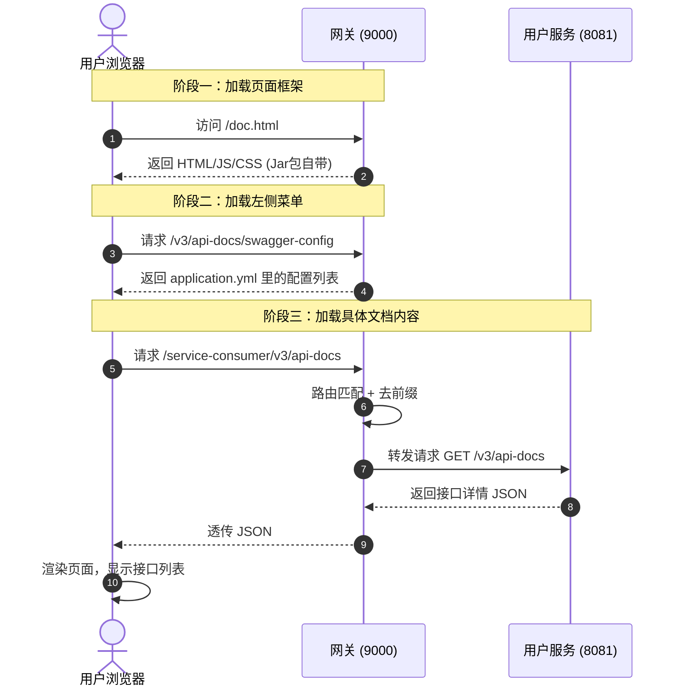

### 🏢 形象比喻：商场导视大屏

1.  **`/doc.html` (网页)**：这就是商场门口那个**触屏设备**。它是通用的，不管放在哪个商场，界面都长这样。
2.  **`application.yml` (配置)**：这是**楼层索引表**。你手动录入了：“1楼是优衣库（Consumer），2楼是星巴克（Provider）”。
3.  **`/v3/api-docs` (后端接口)**：这是店铺里的**商品清单**。优衣库店里才有衣服清单，星巴克店里才有菜单。
4.  **网关 (Gateway)**：就是**商场保安**。大屏本身没数据，它想看优衣库清单时，得让保安跑腿去店里拿。

---

### ⚙️ 技术揭秘：为什么不用配路径就能访问？

#### 1. 为什么地址是 `/doc.html`？
你之所以不需要配置这个路径，是因为你引入了 `knife4j-gateway-spring-boot-starter` 这个 **jar 包**。
*   这个 jar 包里已经**内置**了 `doc.html`、`css`、`js` 等前端静态文件。
*   Spring Boot 启动时，自动配置类会把 `/doc.html` 映射到 jar 包里的这些文件上。
*   **结论**：这是插件自带的“默认首页”，开箱即用。

#### 2. 它是怎么把 Consumer 和 Provider 集中起来的？
这是一个 **“前端请求 -> 网关配置 -> 路由转发 -> 后端返回”** 的 4 步连锁反应。

请看详细流程：

#### 第 1 步：加载“空壳” (Loading Shell)
*   **你的动作**：浏览器访问 `http://localhost:9000/doc.html`。
*   **发生的事**：网关返回了 Knife4j 的 HTML 和 JS 文件。此时页面是空的，只有一个蓝色的框架。

#### 第 2 步：读取“目录” (Fetching Config)
*   **前端动作**：页面加载完 JS 后，自动发起一个请求：
    👉 `GET http://localhost:9000/v3/api-docs/swagger-config`
*   **网关动作**：网关读取你在 `application.yml` 里写的 `knife4j.gateway.routes` 配置。
*   **返回结果**：
    ```json
    [
      {"name": "用户服务", "url": "/service-consumer/v3/api-docs"},
      {"name": "提供者服务", "url": "/service-provider/v3/api-docs"}
    ]
    ```
*   **前端效果**：左上角的下拉菜单渲染出来了！

#### 第 3 步：拉取“内容” (Fetching Data) —— **路由转发的关键**
*   **前端动作**：当你（或默认）选中了“用户服务”，前端发起请求：
    👉 `GET http://localhost:9000/service-consumer/v3/api-docs`
*   **网关动作 (核心)**：
    1.  网关拦截到请求 `/service-consumer/**`。
    2.  **查 Nacos 路由**：发现匹配 `consumer_docs_route`。
    3.  **去前缀 (`StripPrefix=1`)**：路径变成 `/v3/api-docs`。
    4.  **转发**：发给 `lb://service-consumer` (即 8081 或 8082)。

#### 第 4 步：后端响应 (Response)
*   **后端动作**：Consumer 服务收到 `/v3/api-docs` 请求，它的 Knife4j 插件扫描所有 Controller，生成一个巨大的 JSON（包含接口名、参数、返回值）。
*   **回传**：Consumer -> 网关 -> 浏览器。
*   **前端效果**：浏览器拿到 JSON，解析并在页面上画出具体的接口文档。

---

### 🗺️ 全流程时序图



### 💡 总结

你觉得“神奇”，是因为 **网关身兼数职**：
1.  **静态资源服务器**：它负责把 `doc.html` 给你（阶段一）。
2.  **配置中心**：它告诉你有哪些服务可看（阶段二）。
3.  **反向代理**：它帮你去后端服务取数据（阶段三）。

这就是为什么你只需要在网关配一下，不需要动后端代码，也不需要写前端代码，文档就自动聚合了！