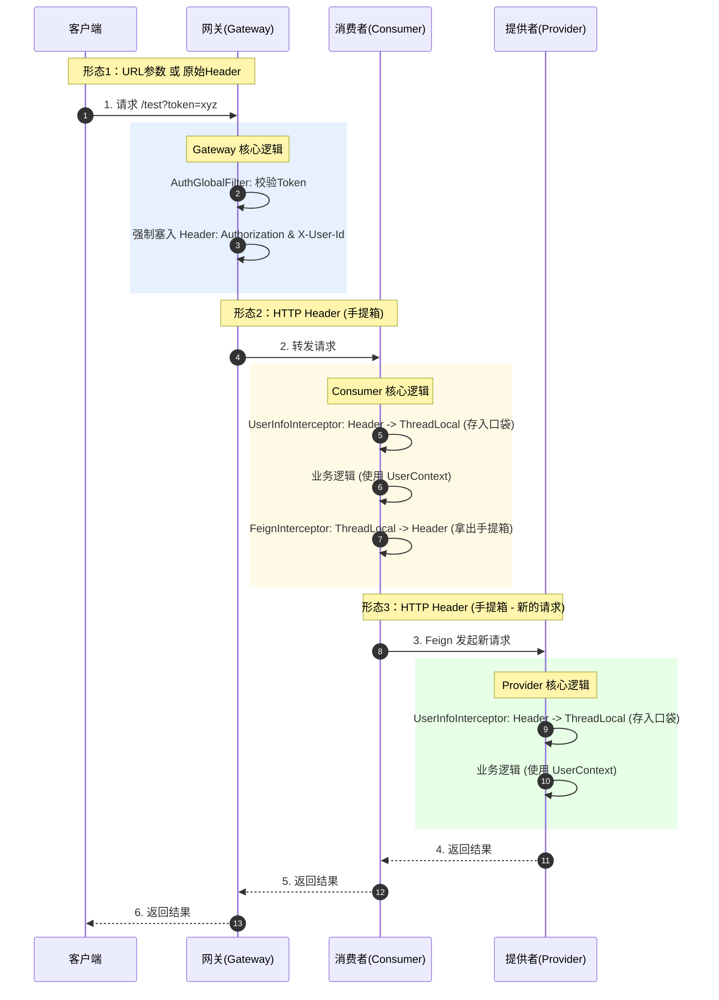

### 🎬 形象比喻：特工与机密文件

想象一下，你的系统是一个层级森严的**军事基地**。
*   **User (用户)**：外来访客。
*   **Token (令牌)**：**通行证**（比如一张磁卡）。
*   **UserID**：**身份工牌**（写着“特工007”）。
*   **Gateway (网关)**：**基地大门安检处**。
*   **Consumer (消费者服务)**：**1号情报大楼**。
*   **Provider (提供者服务)**：**2号档案大楼**。
*   **ThreadLocal**：每个特工自己的**上衣口袋**。
*   **Feign**：连接两栋大楼的**摆渡车**。

#### 剧情开始：

1.  **大门安检 (Gateway)**：
    *   访客带着**通行证(Token)** 来了。
    *   安检员 (`AuthGlobalFilter`) 验证通过，给访客挂上一个**身份工牌(UserID)**。
    *   **关键动作**：安检员把通行证塞进访客的手提箱（Header）里，放行进入 1号楼。

2.  **进入 1号楼 (Consumer 拦截器)**：
    *   访客刚进楼门，门口接待员 (`UserInfoInterceptor`) 拦住他。
    *   **动作**：从手提箱（Header）里拿出通行证和工牌，**塞进访客的上衣口袋 (`ThreadLocal`)**。
    *   **为什么？** 因为在楼里办公（执行业务逻辑）时，特工随时要从口袋里掏出工牌来看看自己是谁，总不能一直拎着手提箱吧？

3.  **前往 2号楼 (Feign 拦截器)**：
    *   1号楼的任务做完了，需要去 2号楼查档案。访客坐上了**摆渡车 (Feign)**。
    *   **问题来了**：摆渡车是辆新车，车上空空如也。
    *   **动作**：上车前，调度员 (`FeignTokenInterceptor`) 喊道：“把口袋 (`ThreadLocal`) 里的通行证拿出来，**重新放回手提箱 (Header)**！”
    *   **为什么？** 因为到了 2号楼，那边只认手提箱里的东西，不认你口袋里的（HTTP请求是无状态的）。

4.  **进入 2号楼 (Provider 拦截器)**：
    *   访客下车，刚进 2号楼大门。
    *   2号楼接待员 (`UserInfoInterceptor`) 再次拦住他。
    *   **动作**：同样从手提箱（Header）拿出通行证，**塞进上衣口袋 (`ThreadLocal`)**。
    *   **为什么？** 2号楼的业务逻辑也要从口袋里拿身份信息。

---

### 🗺️ 技术视角：数据流转全景图

这张图解释了**Token 在不同形态之间的转换**。

---

### 🗺️ 全链路核心流程图 (上帝视角)

`用户请求` -> `Nginx(可选)` -> **`Gateway (网关)`** -> `微服务 (Consumer)` -> `微服务 (Provider)`

我们重点把 **Gateway** 内部放大 100 倍来看。

---

### 🚀 第一阶段：进入网关 (Reception)

**1. 请求到达 (Netty Server)**
*   用户发起请求 `GET /consumer/test`。
*   请求首先打到网关的 **Netty Server**（因为 Gateway 是基于 Reactor Netty 的）。
*   Netty 把底层的 TCP 数据包封装成一个 Java 对象：**`ServerWebExchange`**（你可以把它理解为升级版的 HttpServletRequest）。

**2. 路由匹配 (Route Predicate Handler Mapping)**
*   网关拿着这个 `exchange`，去问它的“路由中心”：**“这货该去哪？”**
*   **细节**：它会遍历内存里的路由表（就是你通过 Nacos 动态加载进去的那些 `RouteDefinition`）。
*   **匹配逻辑**：
    *   检查 `route_to_consumer` -> 断言 `Path=/consumer/**` -> **匹配成功！**
*   **结果**：网关给这个请求贴了个条子：“目标是 `lb://service-consumer`”。

---

### 🛡️ 第二阶段：过滤器链 (Filter Chain) —— 过五关斩六将

现在，请求要穿过一排排的“安检机”（过滤器）。

**3. 防重放 (ReplayAttackFilter)**
*   **动作**：检查 Header 里的 `Nonce` 和 `Timestamp`。
*   **细节**：去 Redis 查 `exists(nonce)`。
*   **结果**：如果存在 -> 403 踢回；不存在 -> 存入 Redis -> 放行。

**4. 全局鉴权 (AuthGlobalFilter)**
*   **动作**：检查 Header 里的 `Authorization`。
*   **细节**：解析 JWT，拿到 `userId=888`。
*   **关键动作**：`request.mutate().header("X-User-Id", "888")`。**（给请求塞进去了新 Header）**。

**5. 流量哨兵 (SentinelGatewayFilter)**
*   **动作**：检查 QPS。
*   **细节**：
    *   根据路由 ID `route_to_consumer` 去查规则。
    *   **令牌桶算法**：桶里还有令牌吗？
    *   **有** -> 拿走一个，放行。
    *   **没有** -> 抛出 `FlowException` -> 被你的 `GatewayConfiguration` 捕获 -> 返回 JSON。

---

### 🔄 第三阶段：转发与负载均衡 (Forwarding)

**6. 负载均衡 (LoadBalancerClientFilter)**
*   **现状**：请求的目标是 `lb://service-consumer`。网关不知道这是哪个 IP。
*   **动作**：网关去问 **Nacos**（或者查本地缓存的 Nacos 列表）。
*   **细节**：
    *   拿到列表：`[192.168.0.1:8081, 192.168.0.2:8082]`。
    *   **算法**：执行**轮询算法 (Round Robin)**。
    *   **决定**：这次选 **8081**。
*   **结果**：请求的目标地址变成了真实 IP：`http://192.168.0.1:8081/consumer/test`。

**7. 真正转发 (NettyRoutingFilter)**
*   **动作**：这是网关的最后一个过滤器。它使用 **Netty Client** 真正向 8081 发起了 HTTP 请求。
*   **注意**：此时网关线程**不会阻塞**（不会傻等），它挂起当前任务，去处理别的请求了。

---

### 🏭 第四阶段：微服务内部 (Service Mesh)

**8. Consumer 接收**
*   Consumer (8081) 收到请求。
*   **UserInfoInterceptor** 拦截 -> 把 `X-User-Id` 存入 **ThreadLocal**。

**9. Feign 调用 Provider**
*   Consumer 代码执行到 `providerClient.hello()`。
*   **FeignTokenInterceptor** 触发 -> 从 **ThreadLocal** 取出 Token -> 塞入新请求 Header。
*   Feign 像浏览器一样，向 Provider 发起请求。

**10. Provider 响应**
*   Provider 收到 Token -> 校验通过 -> 执行业务 -> 返回结果。

---

### 🏁 第五阶段：原路返回

*   Provider 的结果 -> Consumer。
*   Consumer 的结果 -> Gateway (NettyRoutingFilter 收到回调)。
*   Gateway -> 用户。

---

### 🧠 核心知识点总结

1.  **路由**：靠 **Predicate (断言)** 匹配，数据源来自 **Nacos**。
2.  **负载均衡**：靠 **LoadBalancerFilter**，把 `lb://` 替换成真实 IP，默认**轮询**。
3.  **限流**：靠 **SentinelFilter**，基于**滑动窗口/令牌桶**算法，超标就抛异常。
4.  **鉴权/透传**：靠我们自己写的 **Filter + ThreadLocal**，像接力棒一样传递 UserID。
5.  **高性能**：全流程基于 **Netty 异步非阻塞**，线程利用率极高。

**这就是网关系统的“心脏跳动”过程！**