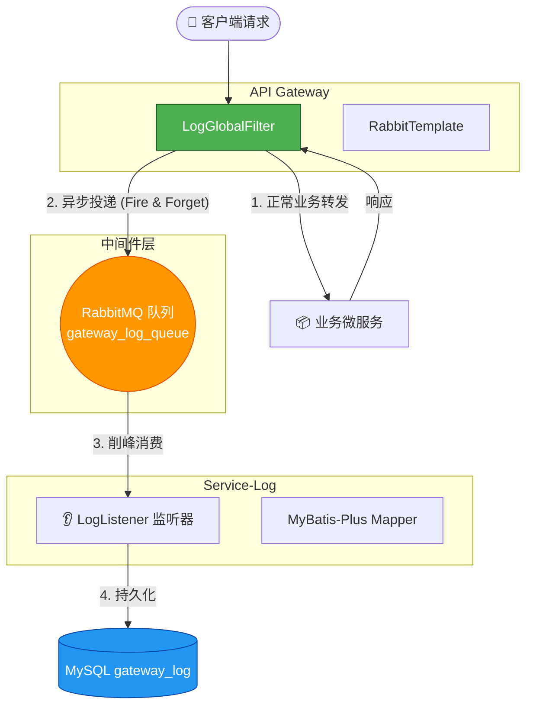

# 📜 网关异步日志与审计设计文档

## 1. 为什么要做这个？(设计初衷)

在微服务架构中，网关是所有流量的入口。我们需要记录每一个请求的 **Who (用户)**、**When (时间)**、**What (路径/方法)** 以及 **How Long (耗时)**。

*   **传统做法的痛点**：如果在网关里直接写数据库（MySQL），数据库的 I/O 瓶颈会直接拖慢网关的响应速度，甚至导致网关阻塞。
*   **我的解决方案**：引入 **RabbitMQ** 进行**异步解耦**和**流量削峰**。网关只负责“抛消息”，日志服务负责“慢存储”。

## 2. 系统架构图 (Data Flow)



## 3. 核心工作流程 (Step-by-Step)

### 🟢 第一阶段：生产者 (网关层)
*   **组件**：`LogGlobalFilter` (实现 GlobalFilter, Ordered)
*   **动作**：
    1.  **请求进入**：过滤器记录 `startTime`。
    2.  **链式放行**：`chain.filter(exchange)` 让请求去执行业务（鉴权、转发等）。
    3.  **请求返回**：利用 `then(Mono.fromRunnable(...))` 机制，在请求响应回来后执行。
    4.  **数据组装**：
        *   计算 `endTime - startTime` 得到耗时。
        *   提取 Header 里的 `X-User-Id` (身份闭环的成果)。
        *   获取 Response 状态码。
    5.  **异步发送**：调用 `RabbitTemplate.convertAndSend("gateway_log_queue", logDTO)`。这一步极快，**完全不阻塞**用户响应。

### 🟠 第二阶段：消息通道 (RabbitMQ)
*   **组件**：Docker 容器 (`rabbitmq:3.12-management`)
*   **职责**：
    *   作为**缓冲区**。如果并发突然很高（比如 1000 QPS），数据库写不过来，消息会先堆积在 MQ 里，慢慢消费，防止数据库被打挂。

### 🔵 第三阶段：消费者 (日志服务)
*   **组件**：`service-log` 模块
*   **监听**：`LogListener` 使用 `@RabbitListener` 注解监听队列。
*   **入库**：一旦收到消息，自动反序列化为 `GatewayLogDTO`，然后通过 MyBatis-Plus 插入 `gateway_log` 表。

---

## 4. 关键技术点 (面试必问)

### Q1: 为什么要把 LogDTO 放到 `service-common` 里？
> **答**：因为这是生产者（网关）和消费者（日志服务）**共用**的数据传输对象。放到 common 模块可以避免代码重复，保证序列化/反序列化时的字段定义一致。

### Q2: 如果 MQ 挂了怎么办？会影响主业务吗？
> **答**：**不会影响**。
> 在 `LogGlobalFilter` 中，我给发送 MQ 的代码加了 `try-catch`。即使 MQ 挂了或发送失败，只会在控制台打印错误日志，**绝对不会抛出异常中断请求**，用户依然能正常收到响应。这叫 **"Fail-Safe" (安全失败)** 策略。

### Q3: 为什么用 RabbitMQ 而不用 Kafka？
> **答**：(结合实际) 目前系统流量级别用 RabbitMQ 足够，且它延迟更低，管理界面友好。如果未来日志量达到每天 TB 级别，可以无缝切换到 Kafka，架构模式（生产者-消费者）是不变的。

---

## 5. 运维与部署 (Docker)

**启动命令**：
```bash
docker run -d --name rabbitmq -p 5672:5672 -p 15672:15672 rabbitmq:3.12-management
```
*   `5672`：Java 代码连接端口。
*   `15672`：网页管理后台端口。

---

### 6. 这个设计还能怎么升级？

#### 🌟 扩展一：死信队列 (Dead Letter Queue - DLQ) —— *日志救生艇*

*   **场景**：
    假设刚才你发的一条日志里，某些字段太长了，导致插入数据库时报错了（SQL Exception）。
    消费者会抛出异常，MQ 默认会**无限重试**（一直报错-一直重试），或者直接丢弃这条消息。这两种都不好。
*   **升级方案**：
    配置一个“死信交换机”。当消费者处理失败（比如入库失败 3 次），RabbitMQ 会自动把这条消息“踢”到死信队列里。
*   **作用**：
    你可以写一个专门的“死信消费者”，把这些入库失败的烂日志，**写到本地文件**或者**发钉钉报警**给管理员。
    **面试话术**：*“为了防止脏数据导致日志丢失，我设计了死信队列机制进行兜底。”*

#### 🌟 扩展二：消息确认机制 (Confirm & Ack) —— *确保万无一失*

*   **场景**：网关显示“发送成功”，但万一网络抖动，MQ 实际上没收到怎么办？
*   **升级方案**：
    1.  **生产者确认 (Publisher Confirm)**：MQ 收到消息后，会给网关回一个 `ack`。网关收到 `ack` 才算真正发送成功，否则重发。
    2.  **消费者确认 (Manual Ack)**：消费者把日志写入数据库**成功后**，才手动告诉 MQ “我吃完了，你可以删了”。如果写库失败，就拒绝确认（Nack）。
*   **代价**：性能会稍微下降一点点，但数据绝对不会丢。

---
